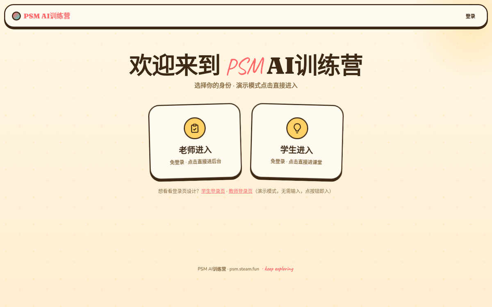
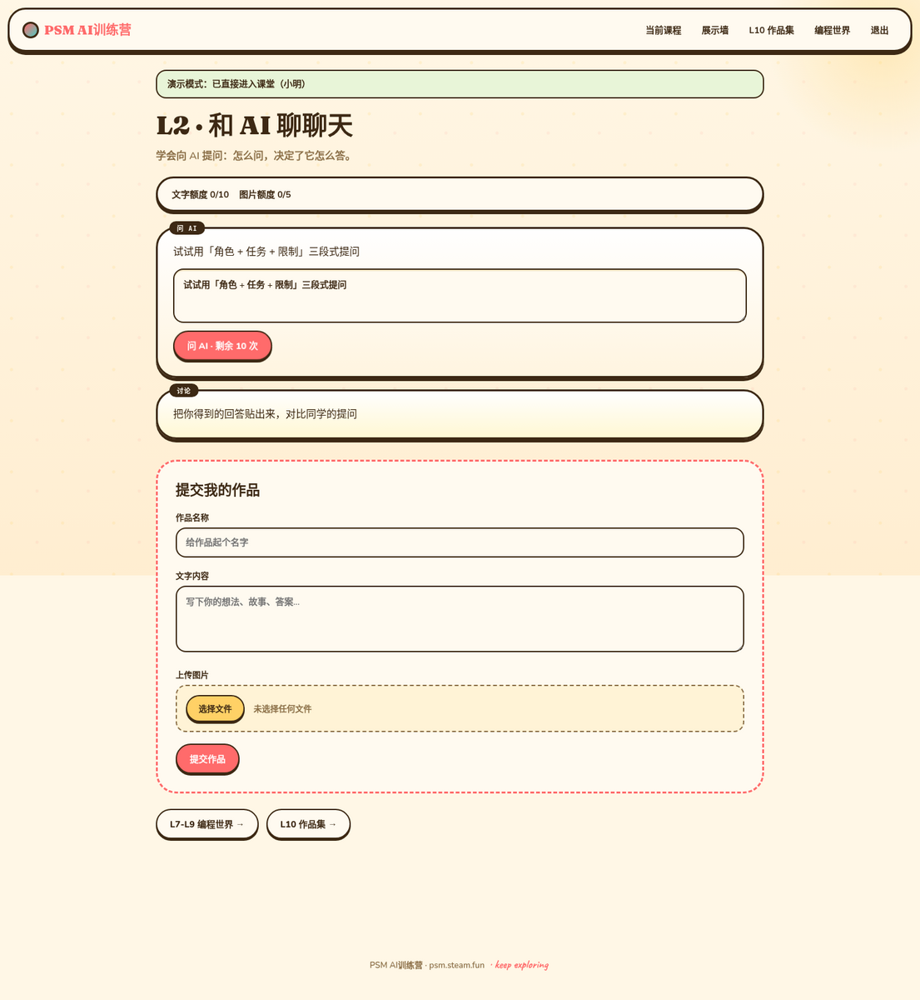
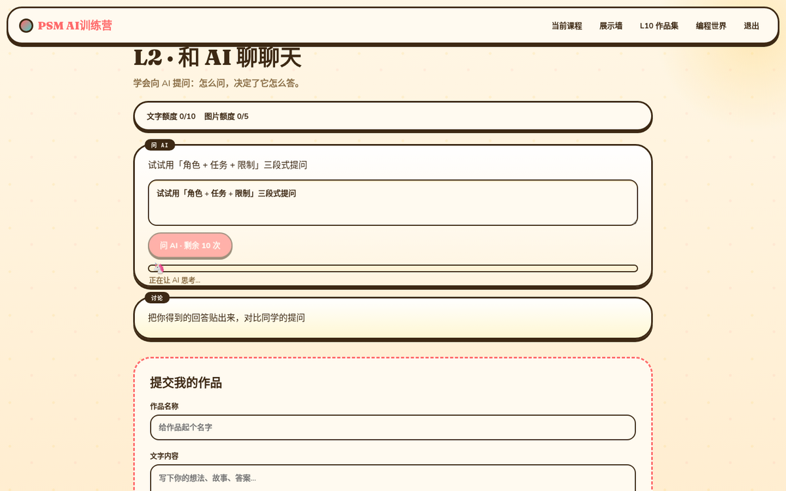
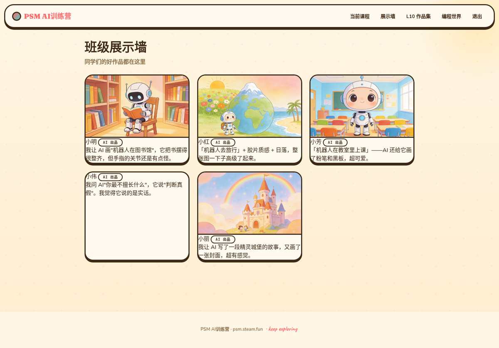
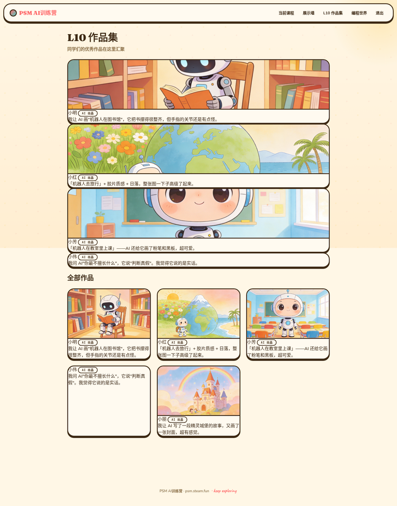
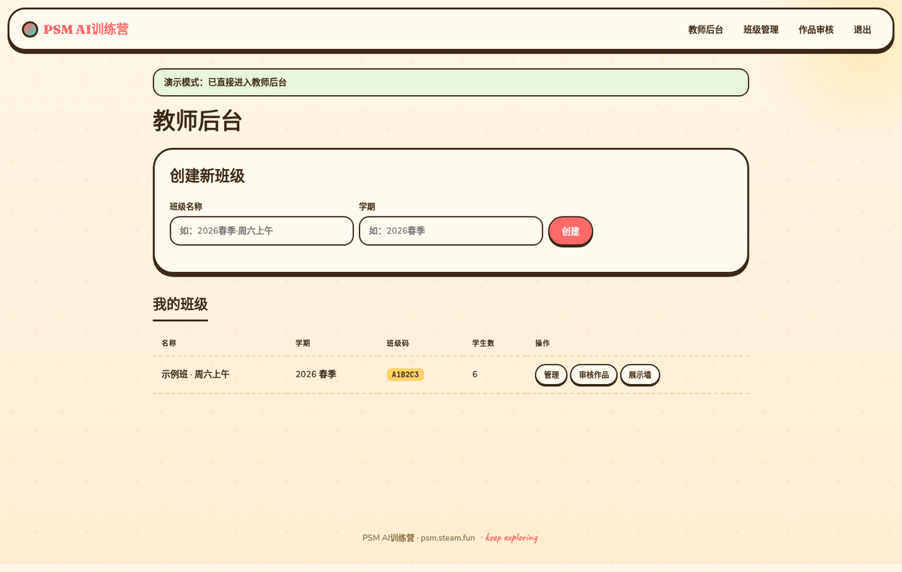
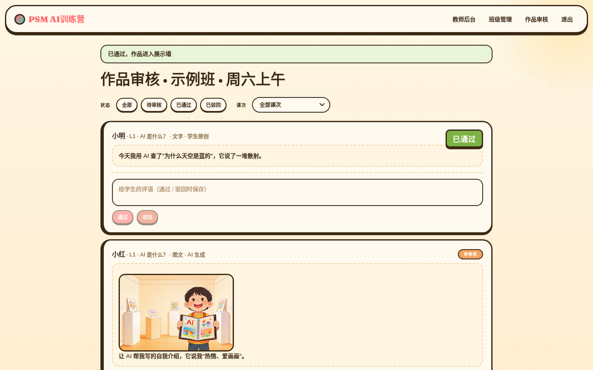

# 前端重构分支 · 奶油乐园定版（agent 交接说明）

> 本文件是 `refactor/frontend-design` 分支的**专用 README**，写给后续接手二次开发的 agent / 开发者。
> 读这一篇就能拿到：背景、定版内容、**效果截图**、文件地图、设计系统、数据层、与原 Flask 后端的**对接报告**、二次开发入口和已知边界。

---

## 1. 这个分支是什么

原仓库是一个 **Flask + SQLite + AGNES AI** 的少儿 AI 教学站（服务端渲染，Jinja2 模板 + 原生 JS，CSS 仅 187 行）。

本分支在**不动原后端代码**的前提下，新增了一套**纯前端定版实现**（`frontend-redesign/`）：

- 把原项目 9 个 Jinja 模板的真实功能 1:1 映射成**单页应用**（10 个 view 区段，无构建步骤，纯 HTML/CSS/JS）
- 视觉定版为 **「奶油乐园」**主题（奶油纸纹 + 大圆角贴纸 + 手写点缀），是用户从三套设计探索（星夜/奶油/像素）中选定的唯一主题
- 登录按用户要求做成**演示直过**：不连数据库、不校验，点击即交互
- 数据层用 `localStorage` 模拟（含种子数据），刷新保留，清存储即重置

定版源码对应 commit `e4e9c9a`。

## 2. 效果截图

> 以下 7 张截图均直接来自本仓库 `frontend-redesign/` 源码（桌面 1440px 视口，缩放至 1200px max-width 入仓）。
> **视觉定版即源码状态**——README 截图与代码完全同步，没有外部部署依赖；克隆后 `python3 -m http.server` 起来就是这个样子。

### 2.1 身份选择（chooser）



两张大卡：老师进入 / 学生进入，演示模式点击即进。奶油纸纹背景、贴纸大圆角、入场错位弹跳（FX #1）+ 3D 倾斜 + glare 高光（FX #2）。

### 2.2 课时页 · L2「和 AI 聊聊天」



完整还原原 `student/lesson.html`：额度条（文字 10 / 图片 5）、活动卡 5 种类型（discussion / agnes_text / agnes_image / create / external）、作品提交流程。

### 2.3 AI 进度条 + 🦄 mascot



点「问 AI」后进度条跑动，独角兽 emoji 跟着填充色走（FX #6）。严格还原原 `askText` 的 12%→92% 进度节奏与 3 段提示（"AI 正在理解问题…→正在组织答案…→快完成了"）。

### 2.4 班级展示墙



通过审核的作品在此展示。3D 倾斜 + glare 跟手（FX #2），每张作品卡 hover 错位反馈。

### 2.5 L10 作品集



精选主图 + 副图布局，把 L1–L10 期间积累的优秀作品集合成一份"小作品集"。

### 2.6 教师后台



创建班级（自动生成 6 位班级码）、班级列表、跳转班级管理与作品审核。

### 2.7 作品审核 · 印章砸下



点「通过」/「驳回」瞬间，绿色"已通过"或红色"已驳回"印章从天而降（FX #8），状态徽章额外弹入。

## 3. 目录地图

```
frontend-redesign/
├── index.html          # 单页骨架：10 个 <section class="view">，data-link 声明式导航
├── app.js              # 全部逻辑：数据层 / 路由 / 视图渲染 / 表单 / 8 处交互特效（约 1400 行，IIFE 单文件）
├── base.css            # 极简 reset + view 显隐（.view / .view.active）
├── theme-creamy.css    # ★ 定版主题：奶油乐园（唯一被 index.html 加载的主题）
├── theme-cosmic.css    # 历史主题：星夜探索（保留未加载，单行 link 可切回）
├── theme-pixel.css     # 历史主题：像素工坊（保留未加载）
├── docs/screenshots/   # ★ README 7 张截图（PNG，1200px max-width，共 ~2MB）
├── assets/images/      # 6 张 AI 预生成配图（展示墙/作品集的种子数据用，共 ~11MB）
├── package.json        # 仅标识（buildless，无依赖、无构建）
└── README.md           # app 级说明（主题切换方法、功能清单、演示账号、本地预览）
```

原 Flask 工程的 `app/`、`run.py`、`config.py` 等**原样保留**，本分支只增不改。

## 4. 设计系统（奶油乐园 token）

全部 token 定义在 `theme-creamy.css` 的 `body[data-theme="creamy"]` 作用域内，改主题 = 改 token，不动组件。

| 类别 | 关键 token | 定版值 |
| --- | --- | --- |
| 背景 | `--bg` / `--bg-2` / `--bg-3` | `#fff7e6` / `#ffeed1` / `#ffe2b0`（奶油渐变 + 双radial纸纹） |
| 表面 | `--surface` / `--surface-2` / `--surface-3` | `#fffaf0` / `#fff3d6` / `#ffe8b3` |
| 文字 | `--text` / `--text-2` / `--text-3` | `#3d2914` / `#8b6f47` / `#b89876` |
| 主色 | `--primary`（珊瑚红 `#ff6b6b`） / `--primary-2`（薄荷 `#4ecdc4`） / `--accent`（暖黄 `#ffd166`） | — |
| 语义色 | `--success #7cb342` / `--danger #e76f51` / `--warning #f4a261` | — |
| 圆角 | `--radius 24px` / `--radius-lg 32px` / `--radius-sm 16px` | 大圆角贴纸语言 |
| 阴影 | `--shadow-sm/sm/lg` | **硬阴影**（`0 6px 0 #e8b96a` 式，不模糊）+ 一层柔和投影 |
| 字体 | display `Fraunces` / body `Nunito` / mono `JetBrains Mono` / 手写 `Caveat` | Google Fonts 自托管 |

响应式断点：**1024px（tablet）+ 720px（phone）**，含 `env(safe-area-inset-*)` 适配。原项目只有 1 个 640px 断点，这是重构的增量之一。

## 5. 8 处交互特效（定版清单）

全部在 `app.js` 的 `FX` 模块内实现，**`prefers-reduced-motion` 时统一降级为 noop**。

| # | 特效 | 实现 | 挂载点 |
| --- | --- | --- | --- |
| 1 | 入场错位弹跳 | `.fx-stagger` 容器，子元素错 60ms + `--pop-rot` 随机旋转角 | 选择卡 / 活动卡 / 作品卡 / 审核卡 |
| 2 | 3D 倾斜 + glare 高光 | `FX.tilt` / `FX.bindTilt`，`mix-blend-mode: soft-light` 高光跟手 | chooser 两张大卡、展示墙作品卡 |
| 3 | 按钮磁吸 | `FX.magnetic` / `FX.bindMagnetic`，最大 4px | 5 个 `.btn.primary` |
| 4 | 点击爆星 | `FX.clickBurst`，指针位置炸 10 颗星（按任务类型换色） | 主按钮 |
| 5 | 提交彩屑 | `FX.submitConfetti`，36 片 | 学生提交作品 / 编程截图 |
| 6 | 进度条 mascot | ResizeObserver 跟随填充宽度，文字条 🦄 / 画图条 🎨 | AI 生成进度条 |
| 7 | 额度用尽抖动 | `FX.shakeCard` | 额度归零后点 AI 按钮 |
| 8 | 审核印章 | `FX.dropStamp`，从天而降绿"通过"/红"驳回" | 教师审核 |

附加：logo hover 摆动、输入框 focus 时 label 微弹。事件走容器委托，不给单按钮重复挂监听。

> 二次开发注意：FX #8（审核印章）实现上有过同步重渲染把刚砸下的印章立刻抹掉的坑——`handleSubAction` 必须在 `dropStamp` 之后**延迟重渲染**（当前是 1500ms），否则静态截图里看不到印章。改这块前先看 `app.js` 的 `handleSubAction` 注释。

## 6. 数据层（localStorage 模拟）

| Key | 内容 |
| --- | --- |
| `psm_db_v1` | classes / lessons / students / gallery / submissions（JSON 单文档） |
| `psm_session` | 当前会话（身份、student_id、class_id） |

`seedDB()` 首次打开自动建：1 个示例班（班级码 `A1B2C3`）+ 名册 + 6 张 AI 配图作品 + 3 个待审作品，保证「提交→审核→展示墙」全流程开箱可点。**清空浏览器存储 = 重置回种子数据。**

注意：上传图片只记文件元信息 + 预选用 assets 图（localStorage 容量限制），接真后端时换成 multipart 上传即可。

## 7. 对接报告：前端 view ↔ 原 Flask 后端映射

> 这一节就是**对接报告**——把定版前端接到原 Flask 后端时，view ↔ 模板 ↔ 路由 ↔ API 的完整对照表。
> 接真后端时先按这张表把 `app.js` 里的模拟实现替换成 fetch，所有交互参数都从原 `app/blueprints/*.py` 直抽。

| 前端 view（index.html 区段） | 原模板 | 原后端路由 |
| --- | --- | --- |
| `v-chooser` | `auth/chooser.html` | `/login` |
| `v-student-login` | `auth/student_login.html` | `/login/student` |
| `v-teacher-login` | `auth/teacher_login.html` | `/login/teacher` |
| `v-lesson` | `student/lesson.html` | `/student/lesson/<id>` |
| `v-l7l8l9` | `student/l7l8l9.html` | `/student/l7l8l9` |
| `v-gallery` | `student/gallery.html` | `/student/gallery` |
| `v-l10` | `student/l10_showcase.html` | `/student/l10` |
| `v-dashboard` | `teacher/dashboard.html` | `/teacher/dashboard` |
| `v-class` | `teacher/class_detail.html` | `/teacher/class/<id>` |
| `v-submissions` | `teacher/submissions.html` | `/teacher/class/<id>/submissions` |

**严格还原的交互参数**（改之前先读原 `app/blueprints/student.py` 与 `app/blueprints/api.py`）：

- `LESSON_CONTENT` L1–L10：标题 / 描述 / 活动类型（discussion / agnes_text / agnes_image / create / external）/ expected_tags / default_prompt，字段从 `student.py` 直抽
- `askText`：进度 12%→92%、900ms 间隔、3 段提示（AI 正在理解问题…→正在组织答案…→快完成了）
- `askImage`：进度 8%→95%、1200ms 间隔、4 段提示 + 队列轮询「前面还有 N 个任务」
- 额度：每学生每课时 **10 文字 + 5 图片**，归零自动禁用
- 教师「通过」即进展示墙；删除学生带 `confirm('确定删除？')`

**接后端时的替换清单**（按改动量从轻到重）：

1. `app.js` 里的 `askText` 模拟实现 → `fetch('/api/generate/text', POST)`，渲染响应
2. `app.js` 里的 `askImage` 模拟实现 → `fetch('/api/generate/image')` 拿 `job_id` → 轮询 `/api/generate/image/status/<job_id>`
3. 登录/提交/审核三处 fetch，按上表路由对照
4. 替换后删 `seedDB()`，让 `psm_db_v1` 退化为可选缓存

## 8. 二次开发入口（按常见任务）

1. **本地跑起来**：`cd frontend-redesign && python3 -m http.server 8000` → `http://localhost:8000/`（无构建、无依赖）
2. **换主题**：`index.html` 里把 `theme-creamy.css` 那行换成 `theme-cosmic.css` / `theme-pixel.css`，`body[data-theme]` 改对应名
3. **改视觉**：只动 `theme-creamy.css` 的 token；组件样式都在该文件内，没有散落的行内样式
4. **接真后端**：按 §7 对接报告替换 `app.js` 里的模拟实现
5. **加课次/活动**：只改 `LESSON_CONTENT`（结构与 `student.py` 一致）
6. **加动效**：进 `FX` 模块，遵守 `prefers-reduced-motion` 降级约定（参考现有实现）

## 9. 已知边界 / TODO

- **未接真后端**：当前是全前端模拟（用户明确要求的演示定版）；AGNES AI、SQLite、配额落库都还没接
- **HTMX**：原项目 `base.html` 加载了 HTMX 但全库未用 `hx-*` 属性——接后端时要么真用上、要么摘掉，别留着装样子
- **可访问性**：特效已做 reduced-motion 降级，但键盘焦点环 / aria 覆盖还不完整，接后端时一并补
- **图片体积**：6 张种子配图共 ~11MB，上生产前建议压缩（当前为保真原样留存）
- **原仓库缺 11 张 L1 大图**：那是 Flask 端 `static/images/` 的事，与本前端无关，见根目录 `MISSING_L1_IMAGES.md`（若在 main 上）

## 10. 协作 / 推送约定（沙箱环境）

- 本分支由 agent 通过 **GitHub Git Data API**（blobs→trees→commits→refs）推送——沙箱 `git push` 直连 github.com 会 TLS 握手失败，**不要在本沙箱里尝试 git push**
- 沙箱网络对 api.github.com 间歇断流：请求强制 `--http1.1`，写操作失败后**先 GET 确认 ref 实际状态**再重试（常见「POST 失败但已落地」陷阱）
- 分支基线 = fork main HEAD `1d6c86c`（完整 78 文件），本分支在此之上只增不改
